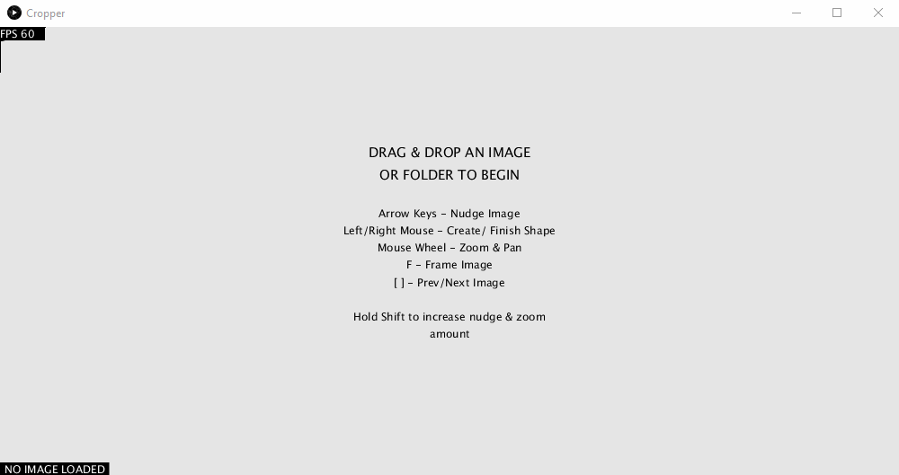

# Cropper
Simple Processing sketch to bulk crop and slice many images

## Todo & Wishlist
* Cropping
    * Make rectangular crops by click dragging.
    * Make freeform crops by clicking points.
    * Click a crop to select & edit it.
    * Line segments can be subdivided by click dragging at their midpoints.
    * The crop orientation can be adjusted.
* Save state
    * Json file kept with references to image files and their crop information.
    * Session is autosaved.
* Exporting
    * For each image, a folder will be made where all crops will be saved. 
    * Each crop will have an optional serial id (numerical) that you can specify as a prefix. (Useful for automation). 

